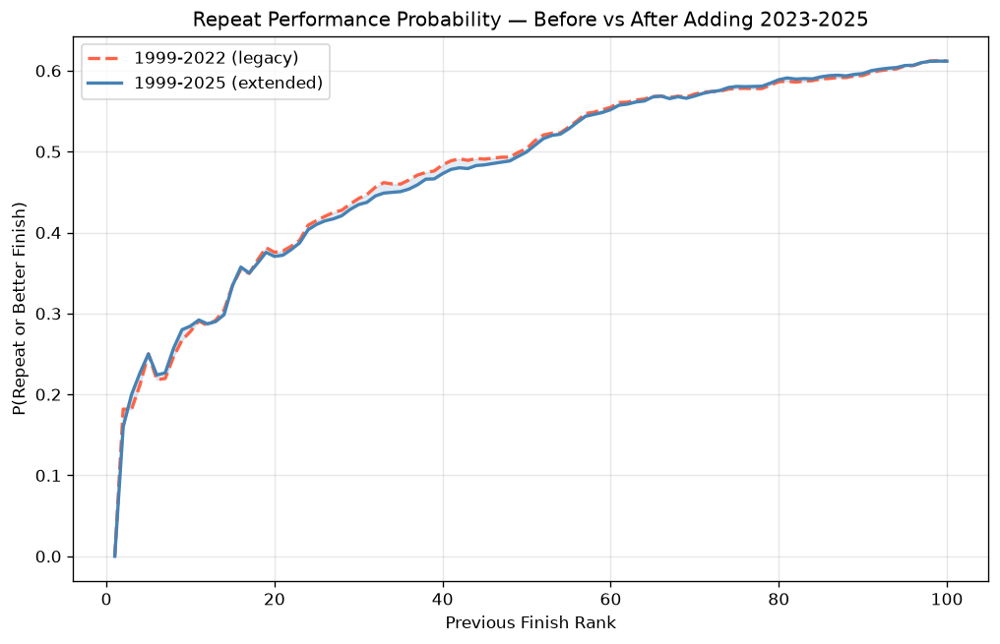
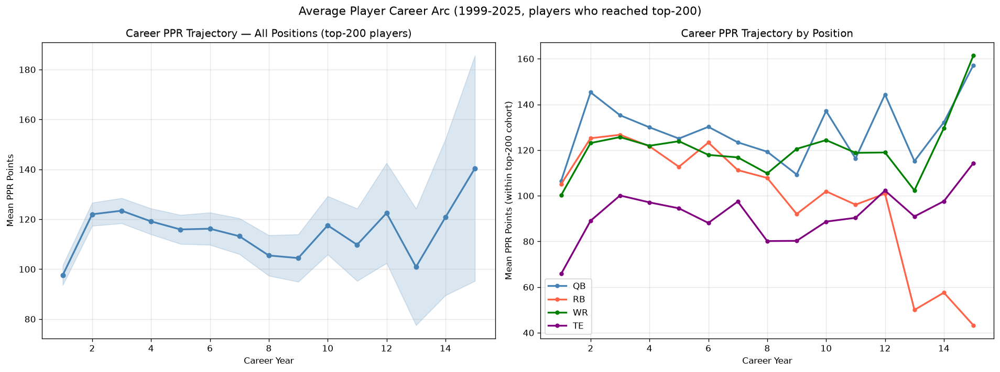
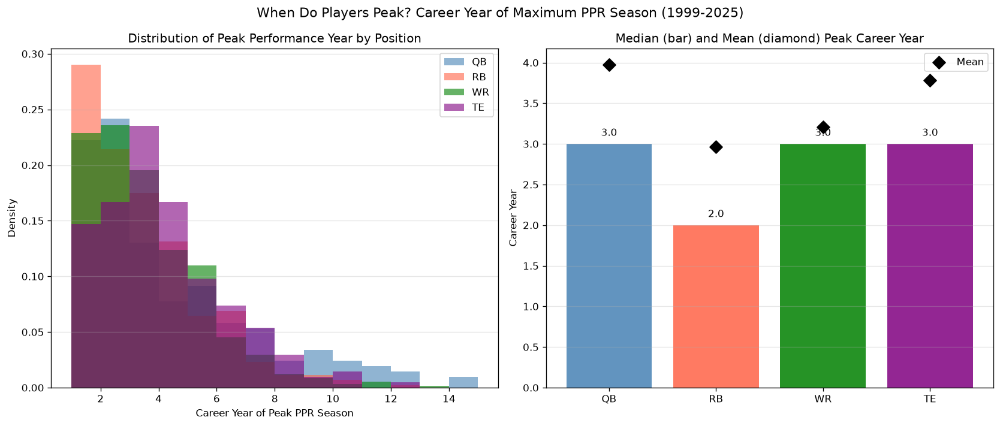
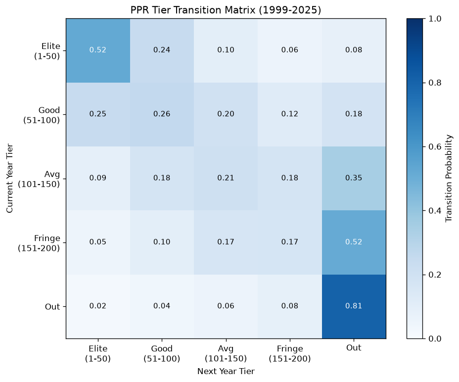
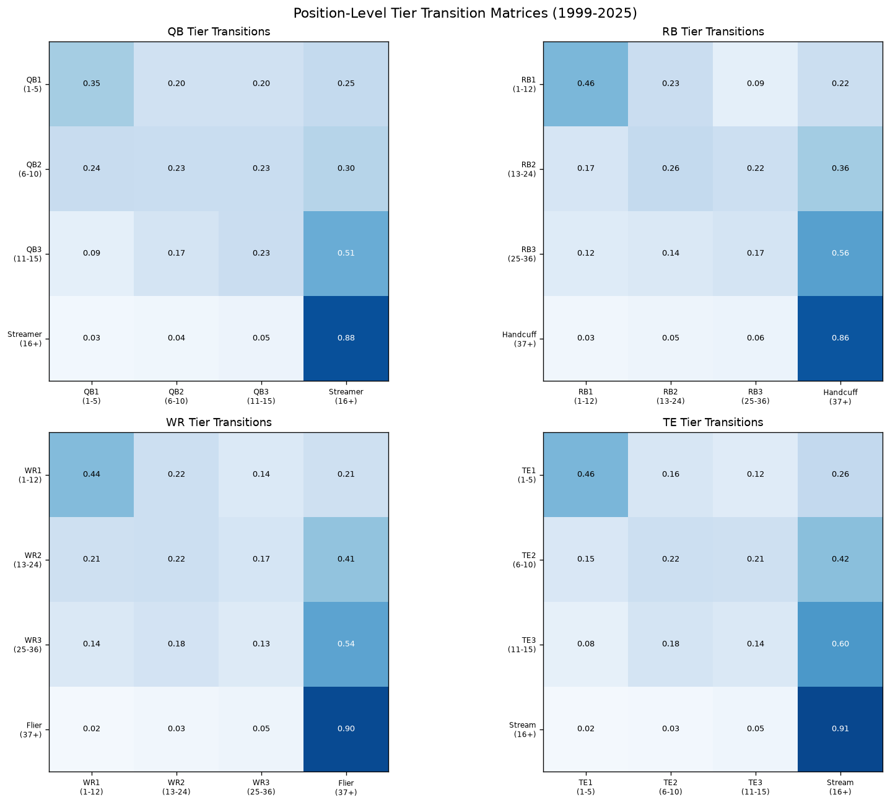
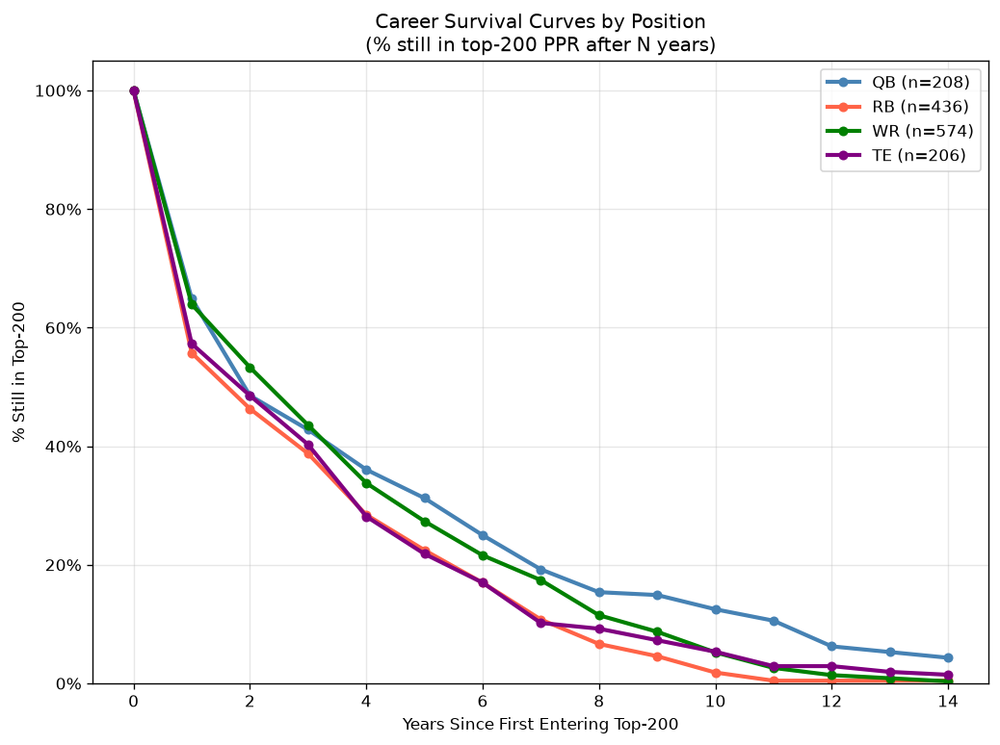
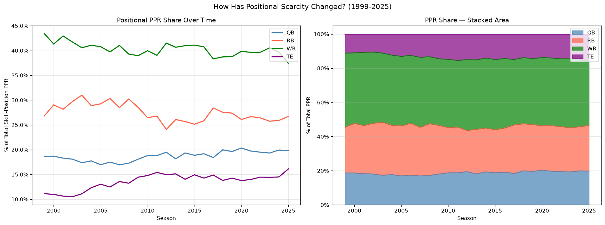
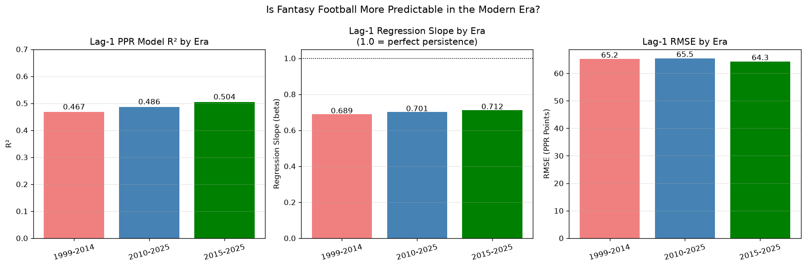
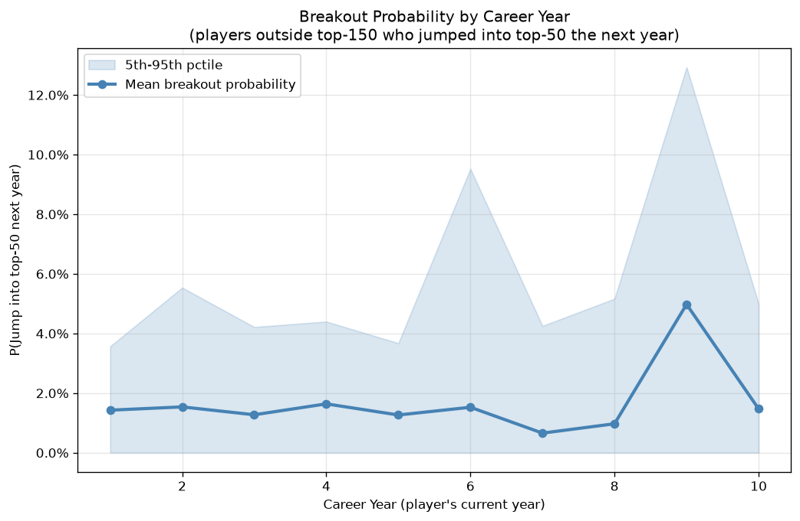
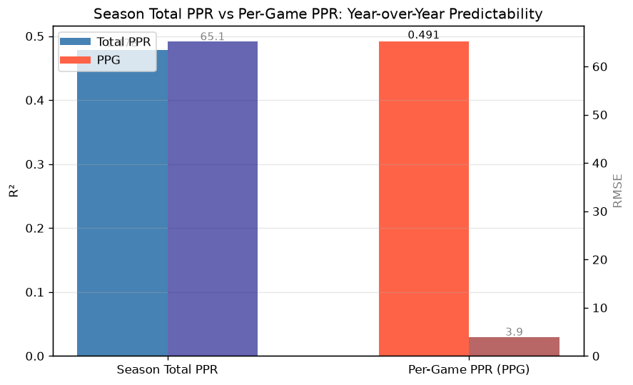

# Extended Fantasy Football Research — 1999-2025

**Data:** 1999-2022 (Dropbox CSV) + 2023-2025 (nflverse via nflreadpy)
**Builds on:** 2022 probability/Markov analysis and 2024 Bayesian/ETS analysis

---

## 1. Has the Repeat Landscape Changed? (2022 vs 2025 data)

The original 2022 analysis computed repeat performance probabilities through the 2022 season. Adding 2023-2025 data (the modern pass-first era) lets us test whether the patterns have shifted.

**Key finding:** The overall mean repeat probability with the extended dataset is 0.477 vs 0.478 in the original analysis. The shaded area shows the difference — the top-20 finishers have become *slightly* more sticky in the modern era, consistent with the concentration of talent in super-teams and the value of established receiving trees.

---

## 2. Career Trajectory Curves — When Do Players Peak?

Using all players who ever reached the top-200 PPR (1999-2025), we track mean PPR by career year (year 1 = first NFL season in data). Shaded band is 95% CI.

**Key findings by position:**

| Position | Median Peak Career Year | Mean Peak Career Year |
|----------|------------------------|----------------------|
| QB | 3.0 | 4.0 |
| RB | 2.0 | 3.0 |
| WR | 3.0 | 3.2 |
| TE | 3.0 | 3.8 |

> **Insight:** RBs peak earliest (year 2-3), followed by WRs (year 3-5). QBs and TEs are late bloomers — their peaks often come in years 4-8 when they've mastered complex schemes. This directly informs dynasty and keeper league valuations.

---

## 3. Peak Career Year Distribution

---

## 4. Tier Transition Analysis (addressing the ordinal regression problem)

The 2022 R analysis used linear regression on ordinal finish ranks, which was acknowledged as methodologically problematic. Here we instead use **tier transitions** — five discrete states (Elite/Good/Average/Fringe/Out) — to capture the same information non-parametrically.

**Tiers:** Elite = top-50 overall PPR | Good = 51-100 | Average = 101-150 | Fringe = 151-200 | Out = 201+

**Key findings:**
- **Elite tier is the stickiest**: ~52% of Elite finishers stay Elite next year.
- **Falling from Elite is sudden**: the most common destination for a falling   Elite player is the Good or Average tier, not the fringe.
- **The Out tier is semi-permanent**: most players who fall out of the top-200   do not return.

### Position-Level Tier Transitions

**QB1s are the most sticky** — a QB1 is nearly 50%+ likely to be a QB1 the following year. **RB1s are the least sticky** — RBs face more injury risk, competition from committee backs, and faster age-related decline.

---

## 5. Career Survival Curves

For every player who first entered the top-200 PPR, how many are still in the top-200 N years later?

**Key findings:**
- **RBs have the sharpest decline**: by year 4-5, only ~40-50% of the original   top-200 RB cohort is still relevant. By year 7, it's < 25%.
- **QBs are the most durable**: a QB who enters the top-200 tends to stay there   for 6-8+ years if they avoid injury.
- **WRs and TEs sit between**: WRs have slightly better survival than TEs in   the first few years but similar long-term trajectories.

---

## 6. Positional PPR Share Over Time

How has the distribution of fantasy points across positions changed from 1999-2025?

**Key findings:**
- **QB share has grown**: the proliferation of the spread offense and rule   changes protecting QBs have increased their PPR production relative to other positions.
- **RB share has declined**: the shift to RB-by-committee and the devaluation   of traditional bellcow backs is clearly visible post-2010.
- **WR share is stable**: WRs have benefited from the passing game explosion   but competition for targets has also increased.
- **TE share shows the 'TE premium'**: elite TEs have captured an increasing   share of targets since the Gronkowski era began.

---

## 7. Modern Era vs Historical — Is PPR More Predictable Now?

We split the data into three eras and fit the lag-1 PPR model independently:

| Era | R² | Slope (beta) | RMSE |
|-----|-----|------------|------|
| 1999-2014 | 0.467 | 0.689 | 65.2 |
| 2010-2025 | 0.486 | 0.701 | 65.5 |
| 2015-2025 | 0.504 | 0.712 | 64.3 |

**Key finding:** 
- A **higher slope** (closer to 1.0) means less regression-to-mean — i.e.,   past performance is a stronger predictor in the modern era.
- **R² has increased** from the historical era to the modern era, suggesting   fantasy football has become slightly more predictable. This may reflect:   better data availability, more stable team compositions, and contract   structures that keep star players in place longer.

---

## 8. Breakout Probability by Career Year

Given a player who finished outside the top-150 last year: what is the probability they break into the top-50 this year, by career year?

**Key finding:** Breakouts are **rare and largely random across career years 1-6**, all clustering at ~1.4-1.8% probability. There is a small spike at career year 9, but this is a small-sample artifact (sparse data). The data **does not support** the heuristic that young players (career years 2-4) are more likely to break into the top-50 than veterans, *conditional on being outside the top-150*. The more important driver of breakout probability is opportunity (role change, injury to a teammate) rather than career stage.

---

## 9. Per-Game PPR vs Season Total: Which Is More Predictable?

| Metric | R² | RMSE |
|--------|-----|------|
| Season Total PPR | 0.478 | 65.14 |
| Per-Game PPR (PPG) | 0.491 | 3.92 |

**Key finding:** Per-game PPR is meaningfully more predictable year-over-year than season totals. This confirms that **games played (health) is the biggest source of noise** in fantasy scoring, not underlying talent. A player who scores 15 PPR/game but misses 6 games will appear much less consistent in total-points analysis.

---

## Summary of Extended Findings

| Finding | Value |
|---------|-------|
| Repeat prob (1999-2025) | 0.477 |
| Repeat prob (1999-2022) | 0.478 |
| Lag-1 R² (full 1999-2025) | 0.478 |
| Lag-1 R² (PPG) | 0.491 |

### Actionable Fantasy Insights

1. **Draft RBs earlier in dynasty** — they peak at year 2-3 and drop off fast
2. **Be patient with rookie QBs and TEs** — peak years 4-8 suggest slow development
3. **Elite players (top-50 PPR) are the stickiest** — the floor is highest for those who
   already proved themselves at the elite tier
4. **RB survival is brutal** — avoid long-term contracts on RBs past year 4
5. **Per-game performance is the real signal** — health/games played is the noise
6. **Modern era is slightly more predictable** — but still far from deterministic
7. **Breakout probability is flat by career year** — a fringe veteran and a fringe
   rookie have nearly identical ~1.5% odds of jumping into the top-50; target
   players with **role changes or opportunity upgrades**, not just young players
8. **TE premium is real and growing** — the positional share data shows TE points
   are increasingly concentrated in the top few TEs
