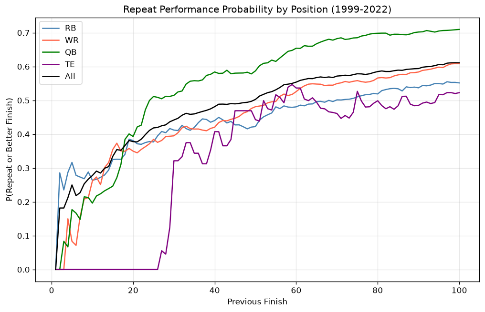
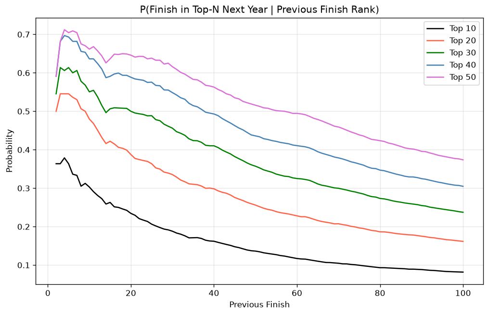
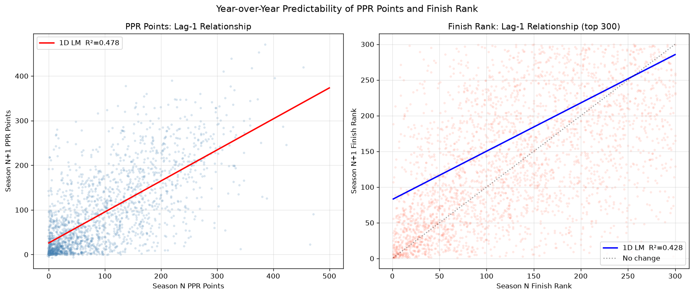
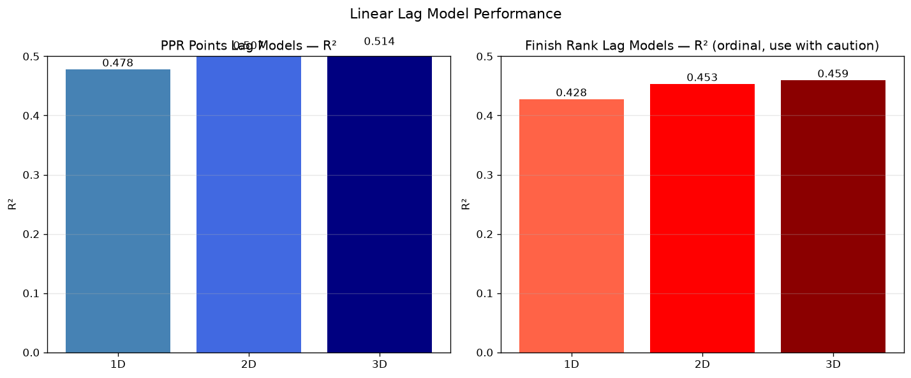
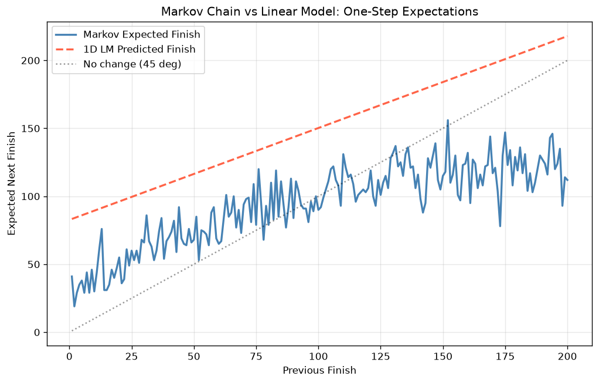
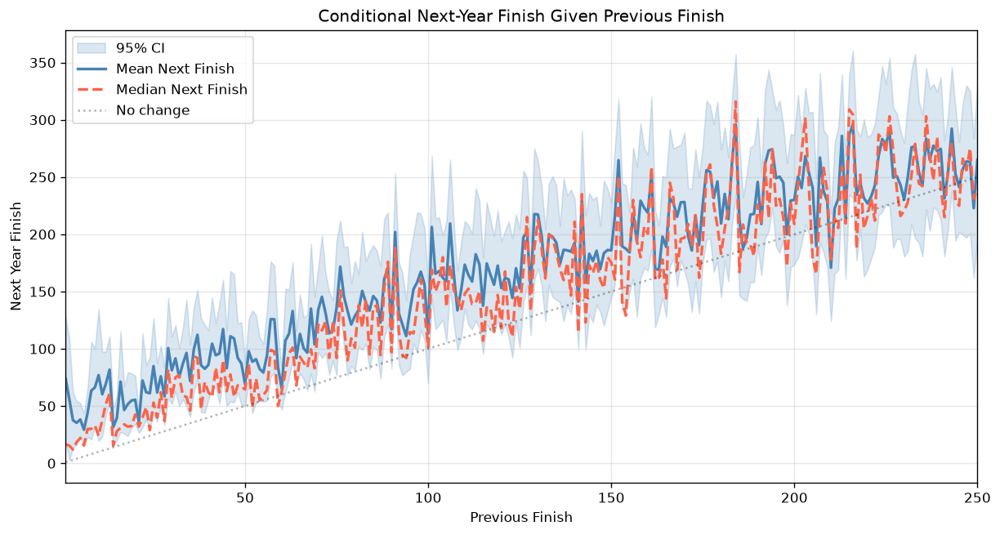
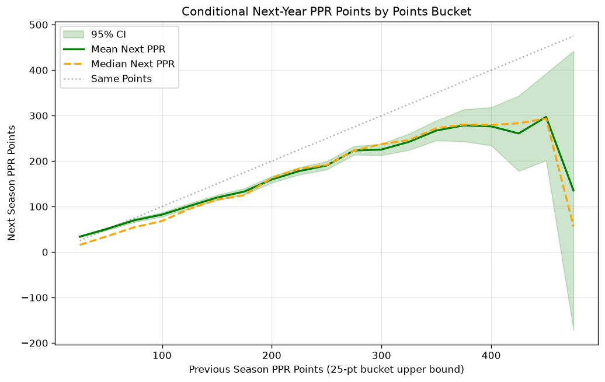
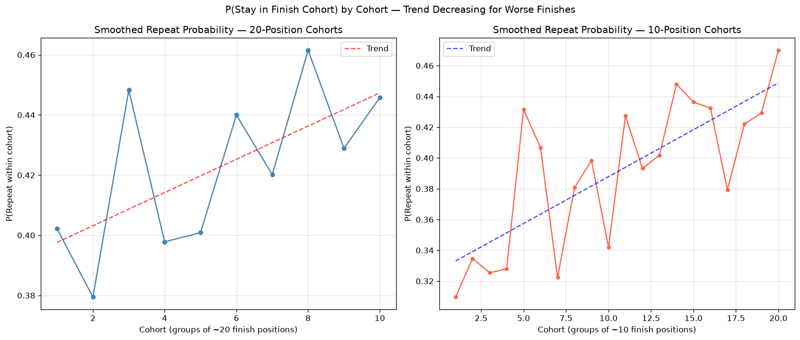
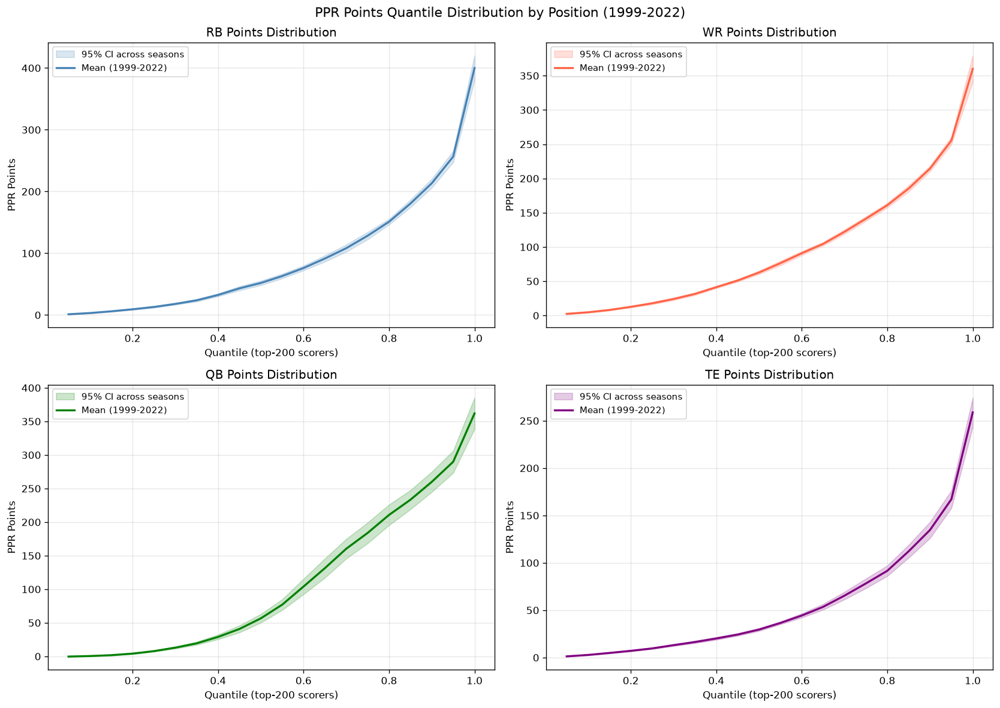

# Legacy Fantasy Football Research — 2022 Analysis

**Source:** Python port of `2022.Research.R` (original R analysis, Aug 2023)
**Data:** `1999-2022.csv` — nflverse season-level PPR statistics (1999-2022)

---

## 1. Repeat Performance Probabilities by Position

For each finish rank k (1-100) we compute the probability that a player who finished at or better than k last season again finishes at or better than k.

**Key findings:**
- Top-5 finishers (any position) repeat at ~50-65%.
- Repeatability drops sharply through the top-20 then stabilises.
- QBs are the most consistent; RBs and TEs show highest volatility.

---

## 2. P(Reach New Finish | Previous Finish Rank)

Given a player's previous finish rank, what is the probability they reach top-10, top-20, top-30, top-40, or top-50 the following year?

**Key findings:**
- A previous top-10 finisher has ~30-40% chance of another top-10 finish.
- From outside the top-50, reaching the top-10 is < 10%.

---

## 3. Linear Lag Models

### R² by Model and Target

| Model | PPR Points R² | PPR Points RMSE | Finish Rank R² | Finish Rank RMSE |
|-------|--------------|-----------------|---------------|-----------------|
| 1D (lag1) | 0.478 | 64.8 | 0.428 | 110.9 |
| 2D (lag1+lag2) | 0.507 | 64.1 | 0.453 | 107.0 |
| 3D (lag1+lag2+lag3) | 0.514 | 64.0 | 0.459 | 105.1 |

> **Note on ordinal data:** Using finish ranks in linear regression is methodologically problematic (acknowledged in the original R code). PPR points models are preferred.

---

## 4. Markov Chain Transition Matrix

A 200×200 transition matrix P(next finish = j | current finish = i) was constructed from empirical year-over-year data (1999-2022). Row probabilities were smoothed via a linear model fit to each row to handle sparsity (~24 observations per finish position).

**Key finding:** Both approaches capture the same regression-to-mean phenomenon. Top-5 finishers are expected to finish ~20-40 the following year on average; players finishing 150-200 are expected to improve toward the middle.

---

## 5. Conditional Repeat Statistics

### By Previous Finish Rank

### By Previous PPR Points (25-point buckets)

**Key finding:** Strong regression-to-mean at both extremes. The 300+ point scorer is expected to score ~220-250 next year; the 50-75 point scorer is expected to score ~100-150.

---

## 6. Smoothed Repeat Probabilities

P(player stays within finish cohort) across rolling cohorts of ~10 and ~20 finish positions (best cohort = 1-10 or 1-20).

**Key finding:** Top cohorts (rank 1-20) have ~55-65% stay-rate. Cohorts beyond rank 100 drop to ~25-30%.

---

## 7. PPR Points Quantile Distribution by Position

Quantiles 5th-100th computed on the top-200 PPR scorers per season per position, averaged across 1999-2022.

**Key findings:**
- **QB**: Tight distribution — 95th percentile ~400 pts, 5th percentile ~150 pts.
- **RB**: Wide — 95th ~350, 5th ~60 pts. High variance position.
- **WR**: Similar to RB but more compressed.
- **TE**: Right-skewed — top TE is often a premium scorer (~300 pts) but the median TE is closer to 80-100 pts.

---

## Summary

| Finding | Value |
|---------|-------|
| PPR Points lag-1 R² | 0.478 |
| PPR Points lag-2 R² | 0.507 |
| Top-10 repeat rate (all positions) | ~35% |
| Top-50 repeat rate | ~45% |
| Best single predictor | Prior year PPR points (lag-1) |

**Bottom line:** Past performance is meaningful (R² ≈ 0.2-0.35) but regression to the mean is very real. No single lag model explains more than 35% of variance in next-year PPR points — the remaining variance is noise, injuries, scheme changes, and other factors not captured here.
