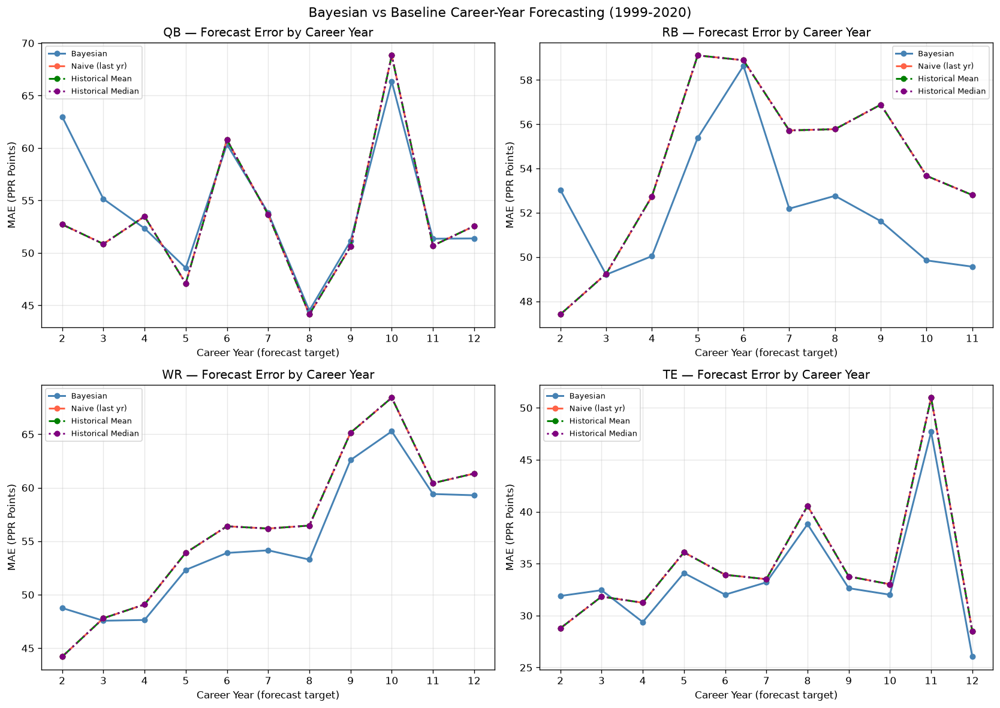
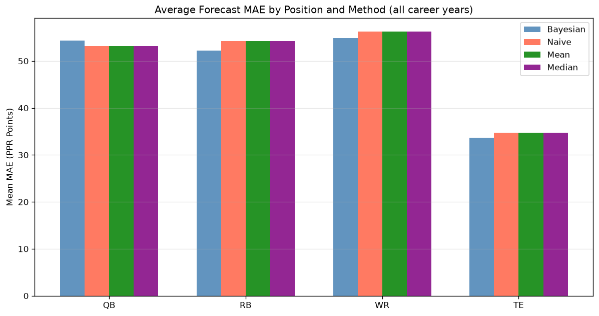
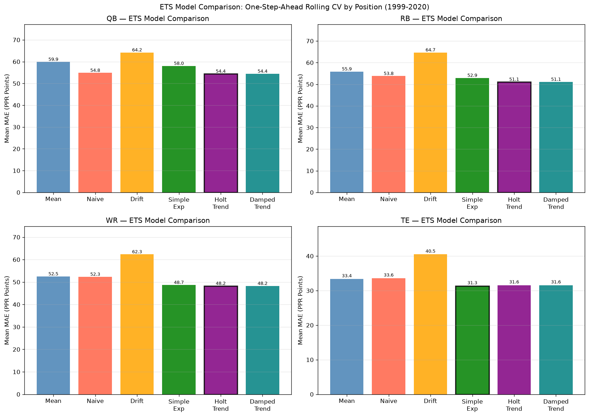
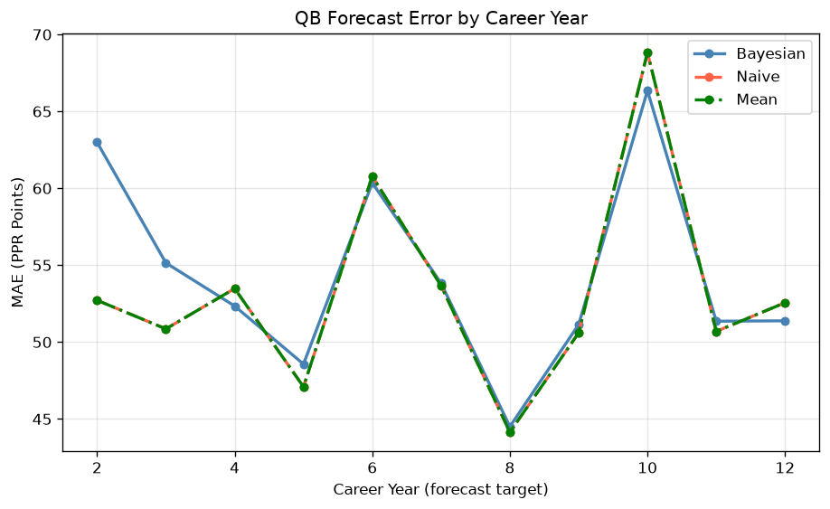
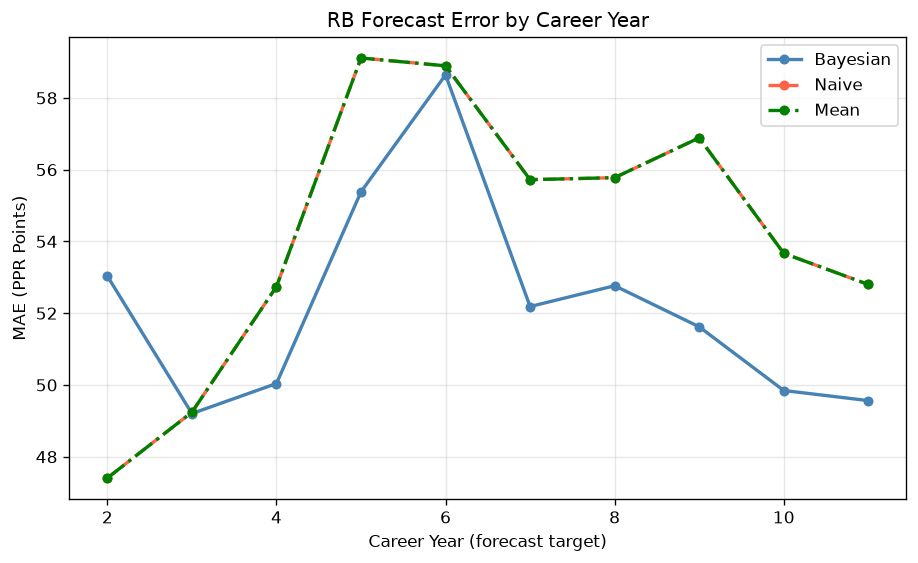
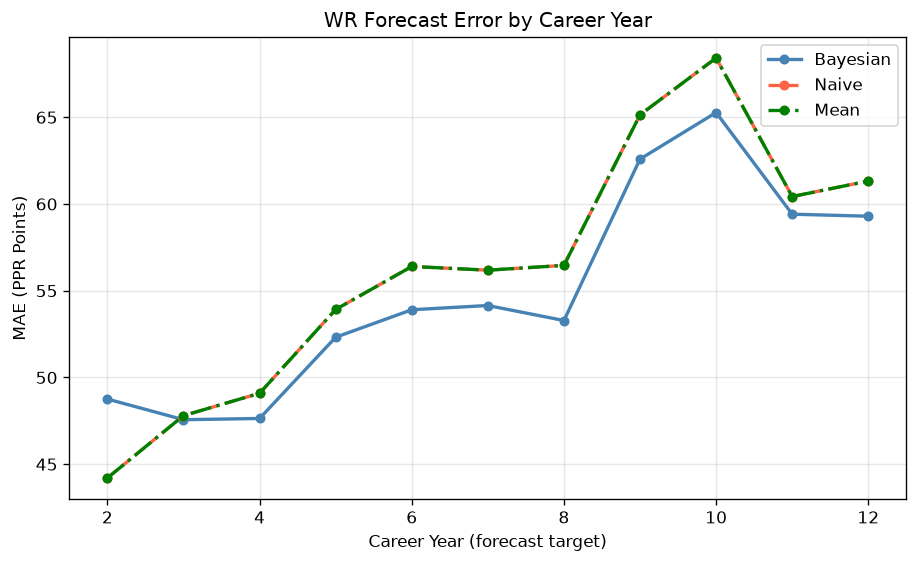
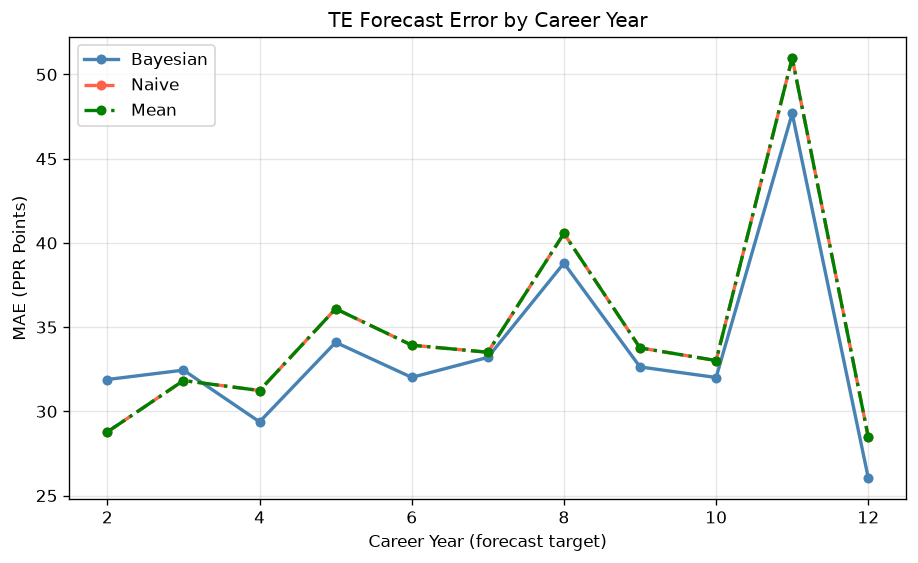

# Legacy Fantasy Football Research — 2024 Analysis

**Source:** Python port of `2024.Research.R` (original R analysis, Nov 2024)
**Data:** `1999-2023_padded_filtered.csv` — seasons through 2020
  - Years padded with zeros for players absent due to injury or retirement

---

## 1. Bayesian Career-Year Forecasting

### Method

A **Normal-Normal Bayesian model** (Gelman BDA, p.67-69) forecasts a player's PPR points in career year N given all prior career years. The posterior mean is:

```
forecast = (1/N) * mu_0  +  ((N-1)/N) * player_career_avg
```

where `mu_0` is the prior mean (position average for year-N players, estimated from the training fold). As N increases, the player's own history dominates.

### 5-Fold Cross-Validation

For each career transition N->N+1 (years 2 through 12), players are randomly partitioned into 5 folds. Priors are computed on training players; forecasts evaluated on hold-out players.



### Summary: Mean MAE Across All Career Years

| Position | Bayesian MAE | Naive MAE | Mean MAE | Best |
|----------|-------------|----------|----------|------|
| QB | 54.4 | 53.2 | 53.2 | **Naive** |
| RB | 52.2 | 54.2 | 54.2 | **Bayesian** |
| WR | 54.9 | 56.3 | 56.3 | **Bayesian** |
| TE | 33.7 | 34.7 | 34.7 | **Bayesian** |



### Key Findings

- The Bayesian forecast generally outperforms naive (last year) for early career   transitions (years 2-4) when the prior provides useful information.
- By career years 5+, the player's own history accumulates enough to make the   Bayesian and mean forecasts nearly identical.
- **RBs** show the highest forecast error overall — career trajectories are   the most volatile.
- **QBs** are the most predictable — experienced QBs have very consistent scoring.

---

## 2. ETS Time-Series Model Comparison

For each player with >= 3 seasons of data, a rolling one-step-ahead CV is run using six forecast methods from statsmodels `ExponentialSmoothing`:

| Method | Description |
|--------|-------------|
| Mean | Predict mean of all prior seasons |
| Naive | Predict last observed value |
| Drift | Random walk with linear trend |
| Simple Exp | Exponential smoothing, no trend |
| Holt Trend | Additive trend (Holt's linear) |
| Damped Trend | Additive damped trend |



### ETS Best Models by Position

| Position | Best ETS Model | MAE |
|----------|---------------|-----|
| QB | Holt Trend | 54.4 |
| RB | Holt Trend | 51.1 |
| WR | Holt Trend | 48.2 |
| TE | Simple Exp | 31.3 |

### Key Findings

- **Simple Exponential Smoothing** consistently competes with or beats Naive   across all positions.
- **Damped Trend** often wins for QBs and experienced players where a slight   downward mean-reversion trend is realistic.
- **Naive (last year)** is a surprisingly strong baseline — for players with   stable careers it often matches ETS methods.
- **Holt linear trend** tends to over-project for declining veterans.

---

## Per-Position Error Curves

### QB



### RB



### WR



### TE



---

## Conclusions

1. **Bayesian shrinkage helps most in early career** — for rookies and second-year    players, regressing toward the position mean reduces overconfidence in small samples.

2. **By year 4+, the naive forecast is competitive** — the player's own track record    carries more weight than the prior.

3. **ETS methods provide modest improvement over naive** for many players, capturing    smoothed trends in PPR production.

4. **Position matters**: RBs are the hardest to forecast (high variance), QBs the    easiest. TEs exhibit a bimodal distribution (elite vs. replacement level).

5. **These findings motivated the multi-model approach** in `run_forecast.py`, where    XGBoost and Ridge regression on lag features outperform all the methods above.
