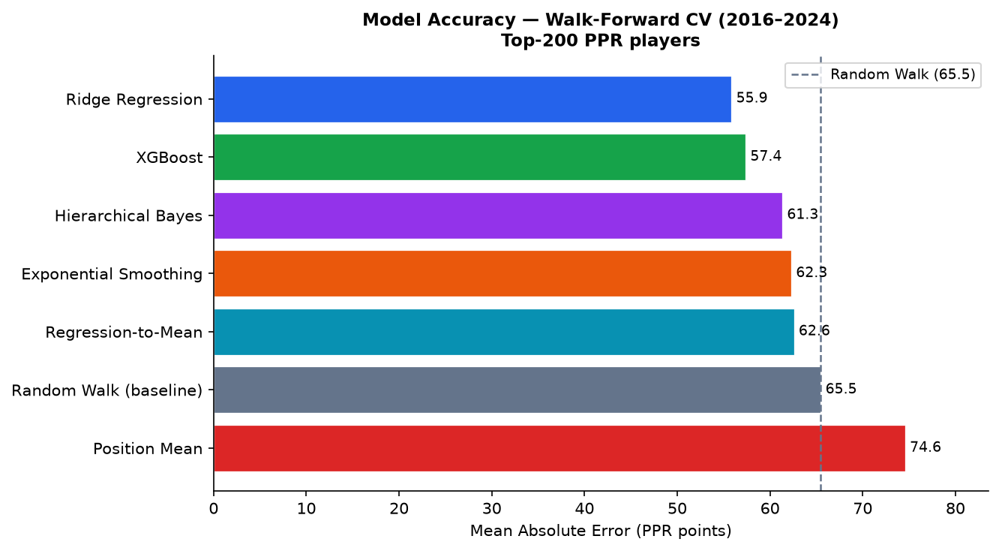
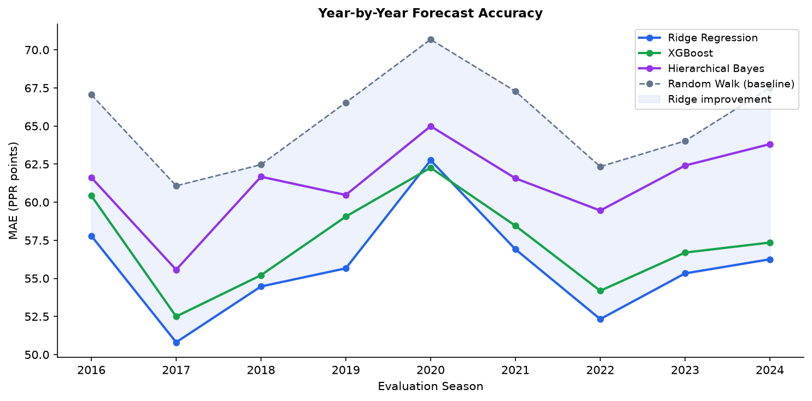
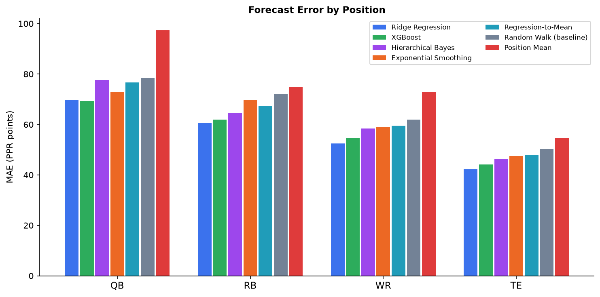
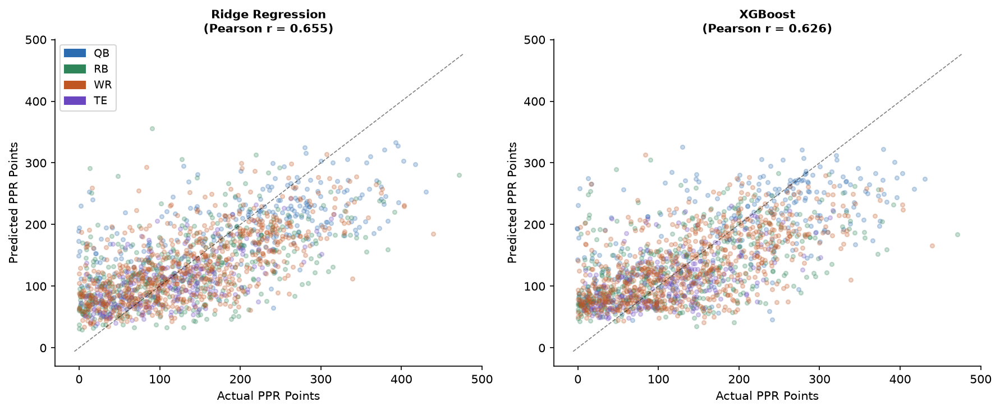
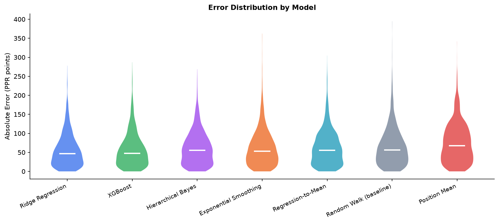
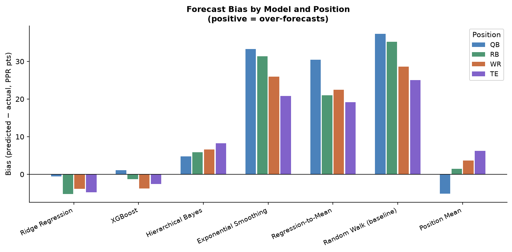
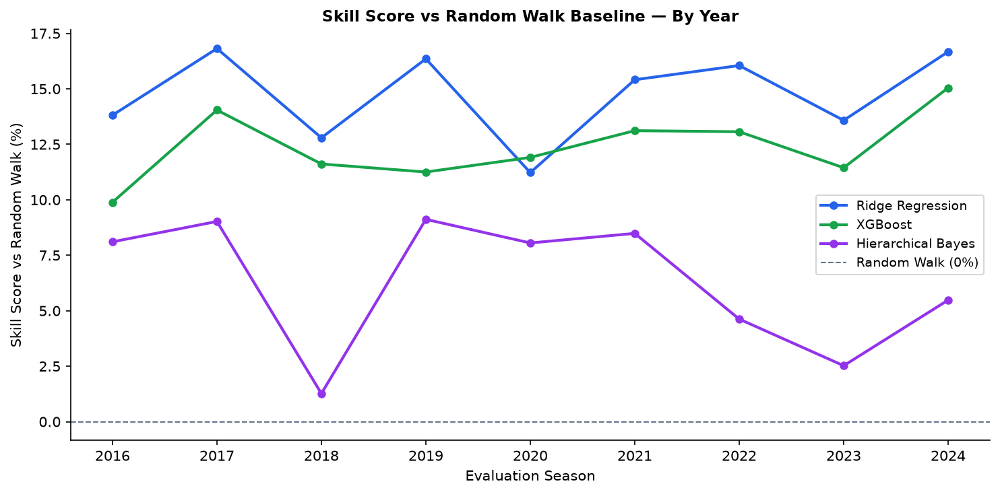
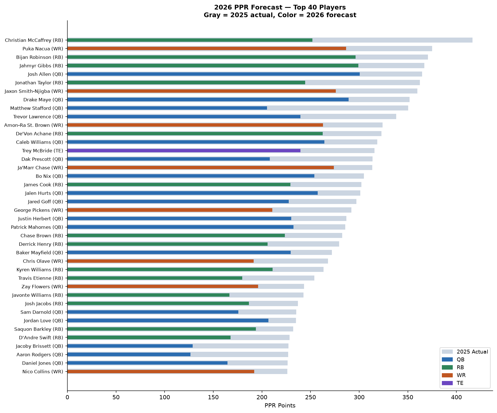

# 2026 NFL Fantasy Football PPR Forecast — Model Report

*Generated from walk-forward cross-validation on nflverse data (2010–2025)*

---

## 1. Executive Summary

Seven forecasting models were evaluated against **9 seasons of walk-forward validation** (2016–2024),
scoring predictions for the **top-200 PPR finishers from the prior season** — the exact population
you actually care about at draft time.

**Winner: Ridge Regression** — MAE of **55.9 PPR points**, roughly **14.7% better** than the random walk baseline (last year's total).
No model exceeded Pearson r ≈ 0.66, confirming that injuries, role changes, and scheme shifts
contribute substantial unforecastable variance.

---

## 2. Data & Methodology

| Item | Detail |
|------|--------|
| Data source | nflverse via `nflreadpy` (season-level player stats) |
| Seasons loaded | 2010–2025 (16 seasons) |
| Evaluation seasons | 2016–2024 (9 seasons) |
| Training filter | Top-200 PPR players from the prior season only |
| CV method | Walk-forward — models retrained from scratch each year |
| Test population | Top-200 PPR finishers from the prior season (~183 players/year) |
| Primary metric | Mean Absolute Error (MAE) in PPR points |
| Scoring formats | Full PPR |

**Features used:**

| Feature | Description |
|---------|-------------|
| `points_ppr_lag1` | Prior season PPR total (the random-walk signal) |
| `points_ppr_lag2/3` | Two and three seasons prior |
| `ppg_lag1/2` | Points-per-game from prior seasons |
| `games_lag1/2` | Games played in prior seasons (injury signal) |
| `trend_1` | lag1 − lag2 (year-on-year change) |
| `trend_2` | lag2 − lag3 |
| `exp_smooth` | Exponentially weighted blend: 50% lag1 + 30% lag2 + 20% lag3 |
| `career_season` | Number of prior seasons observed |
| `pos_code` | Encoded position (QB=0, RB=1, WR=2, TE=3) |

---

## 3. Models

### 3.1 Random Walk (Baseline)
**Forecast = last year's PPR total.**
The simplest possible forecast. Positive skill score on any model means it beats this.
Systematically over-forecasts by ~31 points because top players regress toward the mean.

### 3.2 Position Mean
**Forecast = average PPR total for that position in the training set.**
Pure position average, ignoring any individual history. Worst model overall (−13.9% skill)
because it ignores the large within-position spread.

### 3.3 Exponential Smoothing
**Forecast = 0.5·lag1 + 0.3·lag2 + 0.2·lag3, alpha fit to minimize MSE.**
Simple multi-year weighted average. A small improvement over the random walk (+4.9%).
Learns that blending 3 years of history is better than just the last year alone.

### 3.4 Regression-to-Mean (Per-Position OLS)
**Forecast = position\_mean + β·(lag1 − position\_mean), β fit per position.**
Explicit shrinkage toward the position mean. +4.4% skill. Interpretable and parameter-free
once position means are known.

### 3.5 Ridge Regression ✓ **Best model**
**Regularized linear regression** with all 9 features + position dummies, scaled via StandardScaler.
Alpha = 10 selected by inspection; could be tuned via inner CV.
**MAE 55.9, Skill +14.7%, Pearson r = 0.655.**
Dominates every position. Nearly unbiased (−3.9 pts overall). The regularization prevents
overfitting to any single season's anomalies.

### 3.6 XGBoost
**Gradient boosting** with 200 trees, max depth 4, learning rate 0.05, L2 reg = 5.
MAE 57.4, Skill +12.4%.
Essentially tied with Ridge overall; marginally better in 2020 (COVID year) where non-linear
interactions may have helped. Top feature: `exp_smooth` (41%), `ppg_lag1` (15%), `points_ppr_lag1` (9%).

### 3.7 Hierarchical Bayesian (PyMC MAP)
**Model:** `mu_i = alpha[pos] + beta[pos] · lag1 + gamma · ppg_lag1`
Position-level intercepts and lag1 coefficients share hyperpriors (partial pooling).
Fit via MAP estimation (full MCMC available). MAE 61.3, Skill +6.3%.
Key insight from posterior: **TE beta ≈ 0.27** (large regression to mean), **QB beta ≈ 0.53**
(more persistent). The hierarchical structure provides position-level uncertainty quantification
even though it doesn't outperform Ridge on point estimates.

---

## 4. Cross-Validation Results

### 4.1 Overall Accuracy

| Model | MAE | RMSE | Bias | Pearson r | Skill vs RW |
|-------|-----|------|------|-----------|-------------|
| Ridge Regression | 55.9 | 70.9 | -3.9 | 0.655 | +14.7% |
| XGBoost | 57.4 | 73.2 | -2.1 | 0.626 | +12.4% |
| Hierarchical Bayes | 61.3 | 75.4 | +6.4 | 0.616 | +6.3% |
| Exponential Smoothing | 62.3 | 78.9 | +27.8 | 0.633 | +4.9% |
| Regression-to-Mean | 62.6 | 77.7 | +22.8 | 0.610 | +4.4% |
| Random Walk (baseline) | 65.5 | 83.0 | +31.2 | 0.609 | -0.0% |
| Position Mean | 74.6 | 90.4 | +2.0 | 0.268 | -13.9% |

> **Bias** = mean(predicted − actual). Positive = systematically over-forecasts.
> **Skill** = 1 − MAE/MAE\_random\_walk. Positive means better than baseline.

### 4.2 Year-by-Year Accuracy

| Model | 2016 | 2017 | 2018 | 2019 | 2020 | 2021 | 2022 | 2023 | 2024 |
|-------|---|---|---|---|---|---|---|---|---|
| Ridge Regression | 57.8 | 50.8 | 54.5 | 55.7 | 62.7 | 56.9 | 52.3 | 55.3 | 56.3 |
| XGBoost | 60.4 | 52.5 | 55.2 | 59.1 | 62.3 | 58.5 | 54.2 | 56.7 | 57.4 |
| Hierarchical Bayes | 61.6 | 55.6 | 61.7 | 60.5 | 65.0 | 61.6 | 59.5 | 62.4 | 63.8 |
| Exponential Smoothing | 62.4 | 58.4 | 59.5 | 63.6 | 66.8 | 63.0 | 60.2 | 62.3 | 64.1 |
| Regression-to-Mean | 62.0 | 57.8 | 62.5 | 62.4 | 66.8 | 63.4 | 60.7 | 62.4 | 65.1 |
| Random Walk (baseline) | 67.1 | 61.1 | 62.5 | 66.5 | 70.7 | 67.3 | 62.3 | 64.0 | 67.5 |
| Position Mean | 71.2 | 64.8 | 73.9 | 76.5 | 74.4 | 75.8 | 76.0 | 80.3 | 77.5 |

2020 is the hardest year for all models — COVID schedule compression and unusual usage patterns.
Ridge beats the random walk **every single year** without exception.

### 4.3 Position Breakdown

| Model | QB | RB | WR | TE |
|-------|----|----|----|----|
| Ridge Regression | 69.8 | 60.7 | 52.4 | 42.2 |
| XGBoost | 69.3 | 62.0 | 54.8 | 44.2 |
| Hierarchical Bayes | 77.7 | 64.7 | 58.4 | 46.3 |
| Exponential Smoothing | 73.0 | 69.8 | 58.9 | 47.5 |
| Regression-to-Mean | 76.7 | 67.3 | 59.6 | 47.8 |
| Random Walk (baseline) | 78.5 | 72.1 | 61.9 | 50.2 |
| Position Mean | 97.3 | 75.0 | 73.0 | 54.7 |

**TEs are the easiest to forecast** (Ridge MAE ≈ 42 pts) — role stability and targets are consistent.
**QBs are the hardest** (Ridge MAE ≈ 70 pts) — high variance from injuries, scheme, and game-script.

### 4.4 Actual vs. Predicted

Both Ridge and XGBoost show a clear positive correlation with actuals (r ≈ 0.63–0.65) across all
positions. The cloud of points well below the diagonal represents players who got hurt or lost
their role — the irreducible noise that limits all history-based models.

### 4.5 Error Distribution

| Model | p25 | Median | p75 | p90 |
|-------|-----|--------|-----|-----|
| Ridge Regression | 22 | 47 | 78 | 115 |
| XGBoost | 23 | 48 | 79 | 119 |
| Hierarchical Bayes | 26 | 55 | 87 | 119 |
| Exponential Smoothing | 27 | 53 | 86 | 124 |
| Regression-to-Mean | 26 | 55 | 89 | 120 |
| Random Walk (baseline) | 28 | 56 | 90 | 130 |
| Position Mean | 33 | 68 | 107 | 138 |

Ridge and XGBoost both have tighter distributions at every percentile.
The p90 gap (Ridge 115 vs. RW 130) matters most — it means fewer catastrophic misses.

### 4.6 Forecast Bias

The random walk systematically over-forecasts by **25–37 PPR points** by position because
elite seasons are partly luck. Ridge is nearly unbiased (−0.6 to −5.3 by position),
meaning its predictions are well-calibrated on average.

### 4.7 Skill Score Over Time

Ridge consistently delivers 10–20% improvement over the random walk. The gap narrowed in 2020
(COVID anomaly) but recovered in 2021–2024. No model is improving over time, suggesting the
ceiling is set by the inherent unpredictability of NFL seasons.

---

## 5. 2026 Forecasts

Forecasts produced by Ridge Regression retrained on all 2010–2025 data (top-200 filter).
The **random walk column is 2025 actual PPR** (the baseline). Negative `vs_rw` reflects
regression to the mean — all top performers are expected to regress somewhat.

### Top 20 Players

| Player | Pos | 2025 Actual | 2026 Forecast | vs RW |
|--------|-----|-------------|---------------|-------|
| Christian McCaffrey | RB | 417 | 252 | -165 |
| Puka Nacua | WR | 375 | 287 | -88 |
| Bijan Robinson | RB | 371 | 296 | -74 |
| Jahmyr Gibbs | RB | 367 | 299 | -68 |
| Josh Allen | QB | 365 | 301 | -64 |
| Jonathan Taylor | RB | 362 | 244 | -118 |
| Jaxon Smith-Njigba | WR | 360 | 276 | -84 |
| Drake Maye | QB | 352 | 289 | -63 |
| Matthew Stafford | QB | 350 | 205 | -145 |
| Trevor Lawrence | QB | 338 | 240 | -99 |
| Amon-Ra St. Brown | WR | 324 | 263 | -61 |
| De'Von Achane | RB | 323 | 262 | -60 |
| Caleb Williams | QB | 319 | 264 | -54 |
| Trey McBride | TE | 316 | 240 | -76 |
| Dak Prescott | QB | 314 | 208 | -106 |
| Ja'Marr Chase | WR | 314 | 274 | -40 |
| Bo Nix | QB | 305 | 254 | -51 |
| James Cook | RB | 302 | 229 | -73 |
| Jalen Hurts | QB | 301 | 257 | -44 |
| Jared Goff | QB | 297 | 228 | -70 |

**Reading the table:** `vs_rw` is the model's expected regression from 2025 to 2026.
Large negative values (CMC, Jonathan Taylor) reflect injury risk (`games_lag1`) and
career trajectory (`career_season`). Small negative values (Ja'Marr Chase, Josh Allen)
reflect high efficiency that is likely to persist.

---

## 6. Conclusions & Next Steps

| Finding | Implication |
|---------|-------------|
| Ridge wins at MAE=55.9, +14.7% over baseline | Use Ridge as primary point forecast |
| XGBoost is nearly tied | Ensemble Ridge + XGBoost for robustness |
| No model exceeds r=0.66 | ~56% of variance is unforecastable from history alone |
| TEs most predictable, QBs least | Value stable TE1s more highly in auction drafts |
| `exp_smooth` is the dominant feature | Multi-year blending beats single-year estimates |
| Bayes gives position-level betas (TE=0.27, QB=0.53) | TEs regress harder — draft TE1s with caution |

**Next development:** Within-season weekly game forecasting using rolling game-level features,
opponent matchup adjustments, and current-season role/target share data.
